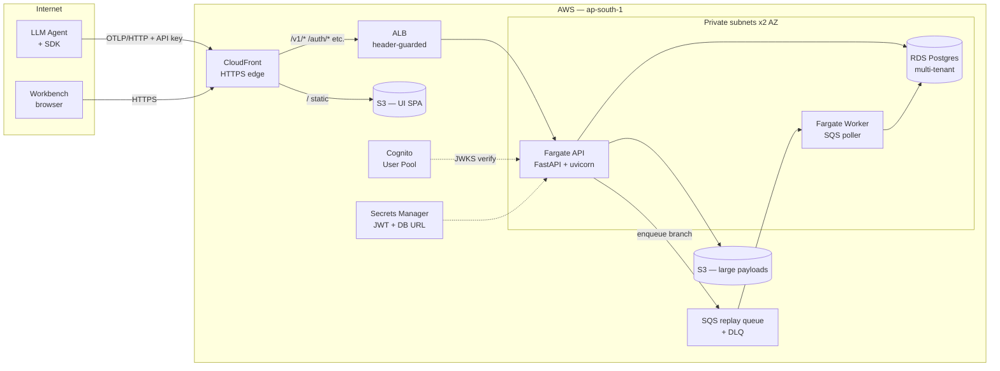
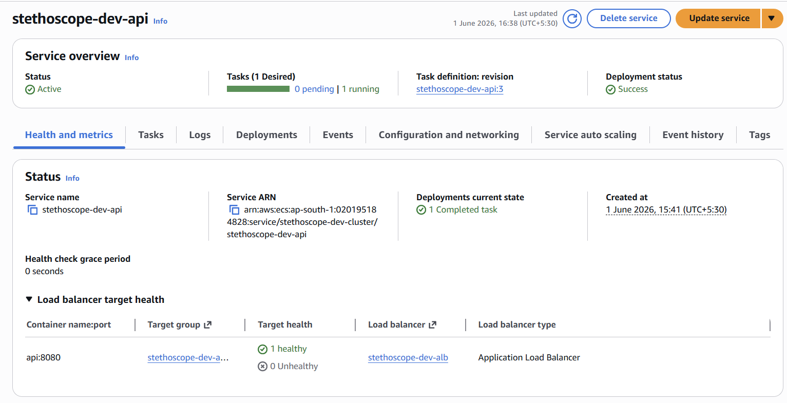
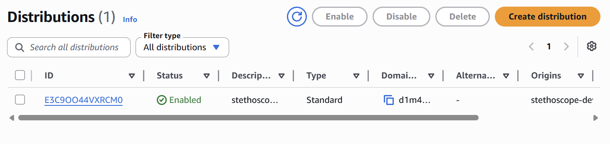
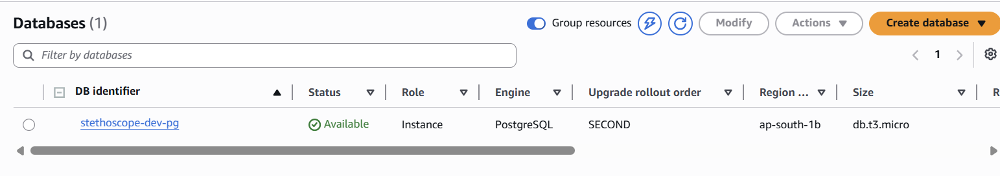
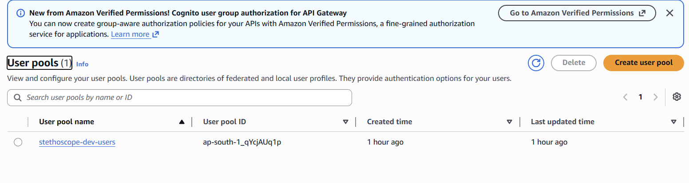
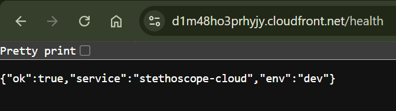

# Stethoscope

[](https://github.com/paavan-mit-1234/stethoscope/actions/workflows/ci.yml)
[](https://opensource.org/licenses/MIT)

### A Time-Travel Debugger for LangGraph Agents

> *"Agents fail silently. We make them speak."*

Stethoscope is a time-travel debugger for LLM agents. It ingests execution
traces (LangGraph first, any OpenTelemetry-compatible agent later),
reconstructs the run as a steppable, replayable, diff-able program, and
presents it through an interface that feels like debugging C in 1998 — not
chatting with an AI in 2026.

**gdb meets Chrome DevTools meets a flight data recorder, for agents.**

---

## The Three Pillars

| Pillar | What It Means |
|---|---|
| **OBSERVE** | See exactly what happened, at any granularity |
| **REPLAY** | Re-run any moment with modifications |
| **COMPARE** | Diff two runs to understand divergence |

## Monorepo Layout

```
apps/
  desktop/        Tauri 2 desktop shell (Rust + React) — "The Workbench"
  web/            Placeholder for future cloud version
crates/
  store/          DuckDB + Parquet trace store (Rust)
  ingestion/      OTLP/gRPC receiver, OTel -> Stethoscope schema (Rust)
  replay/         Deterministic replay orchestrator (Rust)
cloud/            Multi-tenant FastAPI + production-shaped Terraform (AWS)
packages/
  sdk-python/     stethoscope-py: one-line agent instrumentation
  ui/             React frontend ("The Workbench")
```

## Quick Start (local vertical slice)

```bash
# 1. Install the SDK into your agent's environment
pip install -e packages/sdk-python

# 2. Instrument your LangGraph agent (one line)
import stethoscope
stethoscope.attach(graph)

# 3. Run the ingestion service (listens on localhost:4317, OTLP/gRPC)
cargo run -p stethoscope-ingestion

# 4. Run your agent, then list captured traces
cargo run -p stethoscope-cli -- list-traces
```

---

## Cloud Deployment (AWS)

Stethoscope ships with a production-shaped AWS stack — Terraform-managed,
deploy-by-you, scale-to-zero by default. The full architecture:



**Deployed and verified** (June 2026):

| Component | State |
|---|---|
|  | Fargate task healthy behind ALB |
|  | TLS terminating at edge, free `*.cloudfront.net` cert |
|  | Postgres `db.t3.micro` in private subnets |
|  | User pool with custom `tenant_id` attribute |
|  | `GET /health → 200 OK` end-to-end |

70 resources provisioned by [`cloud/infra/`](cloud/infra/): dedicated VPC,
2 AZs, single NAT, ALB+CloudFront secret-header gate, ECS Fargate with
target-tracking autoscaling, RDS in private subnets with encrypted storage,
Cognito user pool with custom tenant attribute, SQS replay + DLQ, S3 with
Glacier lifecycle, CloudWatch alarms + AWS Budgets safety net, GitHub
OIDC deploy role.

### Deploy & destroy

Full procedure in [`cloud/RUNBOOK.md`](cloud/RUNBOOK.md). Three-line summary:

```bash
cd cloud/infra
terraform apply -var alert_email=you@example.com -var db_password='STRONG'
# verify, then:
terraform destroy
```

Designed for the **AWS Free Plan** — `api_desired_count` defaults to `0`,
all dev-mode toggles avoid Multi-AZ / final snapshots / deletion protection.
A real demo session costs roughly **₹20–40 / $0.30–0.50** end to end.

### CI/CD

[`.github/workflows/deploy.yml`](.github/workflows/deploy.yml) handles
build → ECR → ECS rolling deploy + UI S3 sync + CloudFront invalidation via
GitHub OIDC (no long-lived AWS keys in the repo). Auto-skips on PRs that
haven't been bootstrapped with the AWS account variables.

---

## Status

v3.x: cloud-deployable. All five gating CI jobs green:

- ✅ `python sdk` — ruff + pytest on the reference SDK
- ✅ `cloud api` — ruff + pytest on the multi-tenant API (16 tests)
- ✅ `lint (biome)` — TypeScript Workbench formatting
- ✅ `rust ubuntu-latest` — `cargo fmt --check && cargo clippy && cargo test` on the workspace
- ✅ `rust macos-latest` — same matrix entry
- ⚠️ `rust windows-latest` — informational; libduckdb-sys + MSVC + huge-archive cc-rs bug, documented in [`docs/windows-build.md`](docs/windows-build.md). Linux/macOS provide the gating signal.

Total verified tests: **32 passing** (16 cloud + 6 reference Python +
10 Rust). See [`STETHOSCOPE_PRD.md`](STETHOSCOPE_PRD.md) for the design
spec.

## Toolchain

| Tool | Purpose |
|---|---|
| Rust (stable, MSVC on Windows / native on macOS+Linux) | crates + Tauri core |
| Node 20+ / pnpm | frontend + workspace |
| Python 3.10+ | `stethoscope-py` SDK + cloud API |
| Docker | API container + replay sandbox |
| Terraform ≥ 1.5 | AWS infra (only when deploying cloud) |
| AWS CLI v2 | deploys (only when deploying cloud) |

> **Windows note**: the canonical build path is MSVC + Visual Studio Build
> Tools. The GNU fallback documented in `docs/windows-build.md` works when
> MSVC isn't available, with caveats. Real-time AV (Norton, Defender) will
> interfere with cargo's `target/` directory; exclusions documented in
> the same file.

## License

MIT © 2026 Paavan Sejpal
